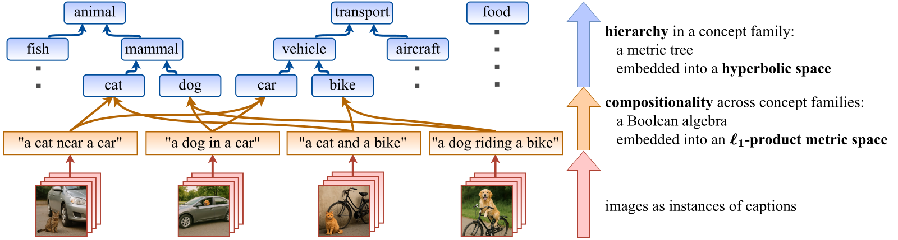
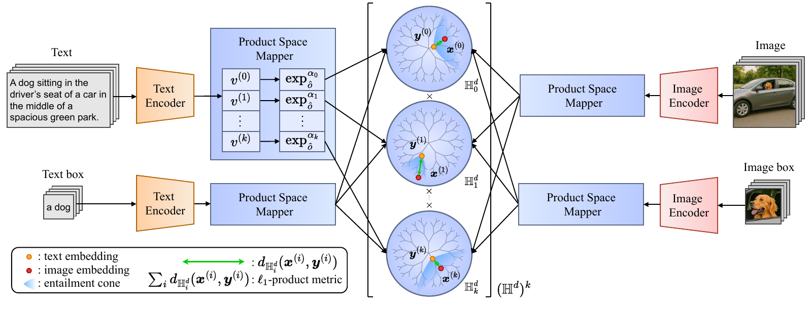

# PHyCLIP: $\ell_1$-Product of Hyperbolic Factors Unifies Hierarchy and Compositionality in Vision-Language Representation Learning (ICLR 2026)

Official paper found at: [OpenReview](https://openreview.net/forum?id=I3Ct1eDmVI) and [arXiv](https://arxiv.org/abs/2510.08919).

## Paper at a Glance



Conceptual diagram of hierarchical and compositional structures.
While all arrows represent entailments ($\preceq$), they differ in nature.
(upper) Linguistic concepts organize tree-like taxonomic  *hierarchies of concept families*, each of which can be embedded into a hyperbolic space.
(middle) Images and texts exhibit *compositionality across distinct concept families*, which can be captured by a Boolean algebra or an $\ell_1$-product metric.
(lower) Images are instances of their corresponding captions.



Overview of PHyCLIP.
Images and texts are encoded as points $\boldsymbol{X}$ in an $\ell_1$-product metric space of hyperbolic factors, $(\mathbb{H}^d)^k$, that is, as tuples of points $\boldsymbol{x}^{(i)}$ in hyperbolic spaces $\mathbb{H}^d_i$.
Their distance is defined as the sum of hyperbolic distances.
The entailment relations $\boldsymbol{X}\preceq \boldsymbol{Y}$ are encoded using entailment cones as $\boldsymbol{x}^{(i)}\in C(\boldsymbol{y}^{(i)})$ within hyperbolic factors $\mathbb{H}^d_i$.

## Citation

```bibtex
@InProceedings{Yoshikawa_2026_ICLR,
    author    = {Daiki Yoshikawa and Takashi Matsubara},
    title     = {PHyCLIP: $\ell_1$-Product of Hyperbolic Factors Unifies Hierarchy and Compositionality in Vision-Language Representation Learning},
    booktitle = {Proceedings of the International Conference on Learning Representations (ICLR)},
    month     = {Apr.},
    year      = {2026},
}
```

## How to Run Code

Our codes were imported from [MERU](https://github.com/facebookresearch/meru) and [HyCoCLIP](https://github.com/PalAvik/hycoclip).

### Dependencies

All dependencies are listed in `pyproject.toml`.
To install them, run:

```bash
pip install -e .
```

### Training

#### 1. Set-up training data (GRIT)

See [HyCoCLIP](https://github.com/PalAvik/hycoclip).

#### 2. Training command

To train a PHyCLIP-ViT-B/16 model, run the following command:

```bash
python scripts/train.py --config configs/train_phyclip_vit_b.py --num-gpus 8
```

Hyperparameters can be easily modified in the [config files](./configs/) or directly within the command (For e.g., add `train.total_batch_size=768` to the command to change batch size).

### Evaluation

#### 1. Zero-shot image classification

The evaluation script auto-downloads and caches 18 (out of 20) datasets in `./datasets/eval`. For ImageNet and Stanford Dogs, please follow the instructions below.

Download and symlink the ImageNet dataset ([Torchvision ImageFolder](https://pytorch.org/vision/main/generated/torchvision.datasets.ImageFolder.html) style) at `./datasets/eval/imagenet`. The Stanford Dogs dataset also needs to be set-up manually using instructions provided in [Pytorch issue 7545](https://github.com/pytorch/vision/issues/7545#issuecomment-1631441616) at `./datasets/eval/cars/stanford_cars`.

To evaluate a trained PHyCLIP-ViT-S/16 model, run the following command:

```bash
python scripts/evaluate.py --config configs/eval_zero_shot_classification.py \
    --checkpoint-path checkpoints/phyclip_vit_b.pth \
    --train-config configs/train_phyclip_vit_b.py
```

#### 2. Zero-shot image and text retrieval

The following datasets are configured in the code: COCO captions and Flickr30k captions. Please refer to the documentation in `phyclip/data/evaluation.py` on how to arrange their files in `./datasets/coco` and `./datasets/flickr30k`. To evaluate PHyCLIP-ViT-S/16 on these 2 datasets, run the following command:

```bash
python scripts/evaluate.py --config configs/eval_zero_shot_retrieval.py \
    --checkpoint-path checkpoints/phyclip_vit_b.pth \
    --train-config configs/train_phyclip_vit_b.py
```

#### 3. Hierarchical classification

We use the WordNet hierarchy of the ImageNet class labels in `./assets/imagenet_synset` for the hierarchical classification task. The ImageNet evaluation dataset needs to be configured as mentioned in _point 1_. To evaluate PHyCLIP-ViT-S/16 on this task, run the following command:

```bash
python scripts/evaluate.py --config configs/eval_hierarchical_metrics.py \
    --checkpoint-path checkpoints/phyclip_vit_b.pth \
    --train-config configs/train_phyclip_vit_b.py
```

#### 4. VL-Checklist evaluation

Prepare evaluation date according to the instructions in [VL-Checklist](https://github.com/facebookresearch/VL-Checklist).

Then run the evaluation:

```bash
python scripts/run_vl_checklist.py \
    --checkpoint-path checkpoints/phyclip_vit_b.pth \
    --train-config configs/train_phyclip_vit_b.py \
    --vl-checklist-config configs/vl_checklist_config.yaml
```

The evaluation results will be saved in `./vl_checklist_results` by default. You can modify the VL-Checklist configuration in `configs/vl_checklist_config.yaml` to customize the evaluation settings.

#### 5. SugarCrepe compositional evaluation

Ensure you have the COCO val2017 images available at `./datasets/eval/coco/val2017/`:

Then run the evaluation:

```bash
python scripts/run_sugarcrepe.py \
    --checkpoint-path checkpoints/phyclip_vit_b.pth \
    --train-config configs/train_phyclip_vit_b.py
```

The results will be saved in `{checkpoint_dir}/sugarcrepe_results/` as both JSON metrics and detailed scores.
